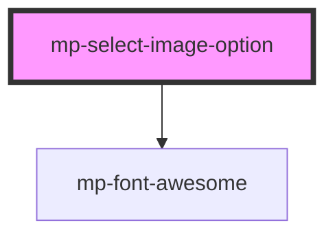

# mp-select-image-option

<!-- Auto Generated Below -->

## Properties

| Property       | Attribute      | Description | Type              | Default |
| -------------- | -------------- | ----------- | ----------------- | ------- |
| `defaultIcon`  | `default-icon` |             | `string`          | `null`  |
| `disabled`     | `disabled`     |             | `boolean`         | `false` |
| `populateList` | --             | ciaone      | `IpopulateList[]` | `[]`    |
| `readonly`     | `readonly`     |             | `boolean`         | `false` |
| `value`        | `value`        |             | `string`          | `''`    |

## Events

| Event          | Description | Type                  |
| -------------- | ----------- | --------------------- |
| `choosedValue` |             | `CustomEvent<string>` |

## Dependencies

### Depends on

- [mp-font-awesome](../mp-font-awesome)

### Graph

----------------------------------------------

*Built with love!*
